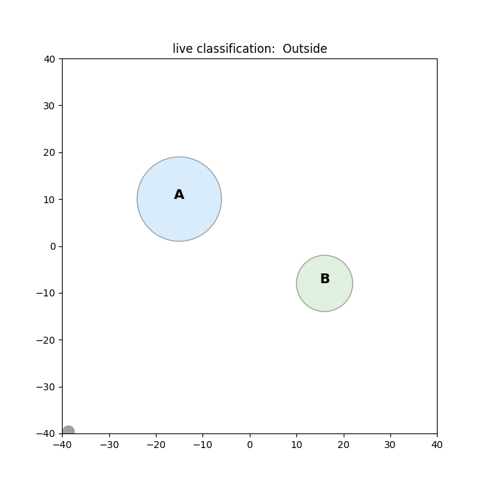

# region-classifier

[](https://github.com/yaniv-tabibian/region-classifier/actions/workflows/ci.yml)


Real-time classification of a moving GPS sensor as **In A**, **In B**, or
**Outside**, using only the two *shortest-distance-to-boundary* streams
`get_dist_a()` and `get_dist_b()` — no position is ever given to the classifier.

> **Two geometries, one solution.** "Disjoint" covers both *adjacent* (the regions
> share a border, gap = 0) and *separated* (gap > 0). Rather than two code paths,
> the gap is treated as **one parameter of a single problem** — and the shipped
> classifier does not even need its value: one general, online/stateful classifier,
> with `Outside` as a first-class state, handles both with no per-case code.
> (Details in **Two cases**, below.)



The sensor wanders through a 2D world containing two disjoint regions. At each
tick it reports its distance to each region's boundary; the classifier decides
the current region **online**, with no post-processing of the trajectory.

---

## How the classifier resolves the single-reading ambiguity

A single distance-to-boundary reading can be **ambiguous**: being 3 m *inside* a
region and 3 m *outside* it both read `3`. Where one sample can't settle it, the
classifier resolves the ambiguity from a small amount of **state carried across
samples** — while still emitting a decision **every tick** (online; it never
waits to accumulate samples, which would be post-processing). The classifier
([`classifier.py`](src/region_classifier/classifier.py)) does this by **combining
two complementary mechanisms — both implemented, neither sufficient alone**:

1. **Boundary-crossing detection (carries the state).** A crossing is the moment
   a distance dips to ~0 and rebounds; each crossing toggles that region's
   membership, propagating In A / In B / Outside as the sensor moves. The
   near-zero threshold is **adaptive** — it tracks the recent `|Δdistance|`
   (≈ speed·dt), so it self-scales with the sensor's non-constant speed.
2. **Half-width anchors (make it self-correcting).** An interior point of a
   region is at most `inradius` from its boundary, so `dist > inradius` *proves*
   the sensor is outside that region — certain from a single sample. This
   overrides the crossing state whenever it would be provably wrong, so the
   classifier can never get permanently stuck in a wrong state.

**Together:** crossing detection carries the membership across samples; the anchor gives
single-sample certainty that keeps it honest. The algorithm is causal and
**O(1)** in time and memory per sample.

## Two cases (adjacent & separated) — assumption & design consequence

"Disjoint" admits two geometries: **adjacent** (the regions share a border;
gap = 0) and **separated** (a strip of Outside lies between them; gap > 0). This
project treats them as **one parameterised problem** rather than two, so both run
from the **same code** with no special-casing — `configs/adjacent_bands.yaml` is
the adjacent case, `configs/two_circles.yaml` the separated one — and `Outside`
is a first-class state the classifier detects directly.

Worth being precise about where the gap lives, since it works out stronger than
"a config option":

* **In the decision rule** ([`docs/DECISION_RULE.md`](docs/DECISION_RULE.md)) the
  gap is an explicit parameter `g`, and the whole rule is written once over
  `g ≥ 0`; `g = 0` collapses the gap branches into the shared-edge case. There is
  no `if adjacent … else …` anywhere — the algebra covers both.
* **In the config** there is no `gap:` key, because none is needed: the gap is
  wherever the YAML places the two regions relative to each other. Move `B`'s
  centre and you have changed the gap.
* **In the shipped classifier** the gap is never supplied at all. It receives only
  the two distance streams plus each region's `inradius`, so it works on either
  geometry without being told which one it is facing.

The classifier is **online and stateful**: in the adjacent case the shared
boundary makes a *single* snapshot ambiguous (near the shared edge, "In A" and
"In B" look identical), so that lone reading can't settle it. The classifier
resolves it by **carrying the last decided side** (one bit of state) and flipping
it when it detects a shared-edge crossing — so it still emits a label **every
tick**, it just doesn't rely on the single sample. That one carried bit is
exactly what lets one general classifier cover both cases.

The output is always **In A / In B / Outside** — never a fourth "ambiguous"
label. Two situations are genuinely uncertain, and they recover on different
timescales:

* **Sitting exactly on a boundary** — resolves within a sample or two, as soon as
  the sensor moves off the line.
* **Cold-starting already inside a region** — takes longer, and it is worth being
  precise about why. The classifier begins with both membership bits `False`
  (i.e. Outside), which is correct for the shipped scenarios: the sensor starts at
  a corner of the field. Started *inside* a region instead, the first boundary
  exit inverts that region's bit (a dip-and-rebound reads as an entry), and only
  the half-width anchor can reset it — which requires the sensor to travel more
  than one `inradius` clear of that region. Measured over 540 randomised
  cold-start-inside scenarios: median **173 ticks** to lock on, 90th percentile
  **435**. So this is "self-corrects once the sensor gets an inradius away", not
  "within a sample or two". Seeding the initial state from the first reading would
  shorten it; the shipped default is chosen to match how the simulator starts.

## Assumptions

The problem's givens (the design and behaviour they lead to are covered in the
sections above):

- **Inputs only:** the classifier is given `get_dist_a()` / `get_dist_b()`
  (unsigned shortest distance to each region's boundary) — never the position.
- **Known, configurable geometry:** region sizes, shapes, and positions — and so
  any gap between them — come from YAML config, not hard-coded constants.
- **Disjoint regions:** the sensor is in A, in B, or Outside — never in two at once.

## Install

**Requires Python 3.10+.** Install from source (editable):

```bash
git clone https://github.com/yaniv-tabibian/region-classifier.git
cd region-classifier
python -m venv .venv
source .venv/bin/activate        # Windows: .venv\Scripts\activate
pip install -e ".[viz,dev]"      # 'viz' adds matplotlib, 'dev' adds test/lint tools
```

(Or `make install`. A `Makefile` wraps the common tasks: `make run`, `make test`,
`make lint`, `make format`, `make demo`. For a minimal, runtime-only install use
`pip install -e .` — without matplotlib or the dev tools.)

## Quick start (zero config)

```bash
region-sim            # runs a bundled default scenario, live in the console
region-sim --version
region-sim --help     # list all options
```

## Run

```bash
# no arguments -> the bundled default scenario, live in the console
region-sim

# Case 2 (separated): validate every tick against ground truth, print accuracy
region-sim --config configs/two_circles.yaml --no-realtime --validate

# Case 1 (adjacent): the same, on the shared-edge rectangles
region-sim --config configs/adjacent_bands.yaml --no-realtime --validate

# live map (needs the viz extra), or render a GIF headless
region-sim --config configs/adjacent_bands.yaml --plot
region-sim --config configs/two_circles.yaml --save-gif examples/demo.gif --duration 30
```

Sample output:

```
t=  41.2s  d_a=  0.13  d_b= 22.90  ->  In A      (truth: In A     OK)
t=  55.7s  d_a= 18.40  d_b=  0.09  ->  In B      (truth: In B     OK)
accuracy vs ground truth: 99.57% over 1200 ticks
```

The remaining <0.5% are the one-sample transients at the instant of a crossing —
inherent to a causal decision from unsigned distances.

## Configuration (sizes & shapes are external, not constants)

Scenarios are YAML files under [`configs/`](configs). Regions may be `circle`,
`rectangle`, or `polygon`, of any size and position:

```yaml
seed: 42
dt: 0.1
duration_s: 120
pasture: {xmin: -40, ymin: -40, xmax: 40, ymax: 40}
regions:
  A: {type: circle,    center: [-15, 10], radius: 9}
  B: {type: rectangle, center: [16, -8], width: 12, height: 10}
motion: {mean_speed: 3.0, speed_sigma: 1.5, turn_sigma: 0.4}
noise:  {distance_std: 0.0}
```

* `configs/two_circles.yaml` — two disjoint circles with an Outside gap.
* `configs/adjacent_bands.yaml` — two rectangles that **share an edge**
  (direct A↔B transitions).

A `polygon` region is given by `points: [[x, y], ...]` instead of a center + size.

## How the simulation is wired

```
config (YAML) ─▶ geometry (shapes) ─┐
                                     ├─▶ Sensor  ─get_dist_a()/get_dist_b()─▶ RegionClassifier ─▶ label
config (YAML) ─▶ motion (var speed) ─┘  (hides position)                        (online, O(1))
```

* [`geometry.py`](src/region_classifier/geometry.py) — shapes + distance-to-boundary + `inradius`.
* [`motion.py`](src/region_classifier/motion.py) — correlated random walk with Ornstein–Uhlenbeck (variable) speed.
* [`sensor.py`](src/region_classifier/sensor.py) — hides the true position; exposes only the two getters.
* [`classifier.py`](src/region_classifier/classifier.py) — the online classifier.
* [`simulator.py`](src/region_classifier/simulator.py) — the real-time loop.

See [`docs/DECISION_RULE.md`](docs/DECISION_RULE.md) for the unified decision rule
(both cases) at a glance — the static reference rule of which `classifier.py` is
the online form. That rule is independently verified against ground truth by the
harnesses in [`tools/`](tools) (see [`tools/README.md`](tools/README.md)): 560,000
samples per case, 0 confident-wrong and 0 wrongly-abstained, plus an impossibility
proof for why the adjacent case needs one bit of state.

## Tests

```bash
pytest            # 26 tests (21 core + 5 optional stress): geometry, classifier, config, CLI, end-to-end accuracy
ruff check . && mypy && black --check .
```

The classifier is tested in isolation on hand-crafted distance streams
(enter/leave, adjacent A↔B via a shared edge, grazes that must not toggle,
anchor self-correction), plus an end-to-end run asserting ≥95% accuracy.

Why ≥95% and not 100%: a **causal** classifier can't hit 100% — at the instant
of a crossing the label lags by one sample (it only knows a crossing happened
once the distance rebounds), so a few transient ticks per run are unavoidable.
95% is a deliberately loose floor to keep the test non-flaky; real runs score
~99.5% (see the accuracy note above).

## License

MIT — see [LICENSE](LICENSE).
